[English](README.md) | [Bahasa Indonesia](README_ID.md)

# Nawng Digital Ecosystem

Studi kasus portofolio yang mendokumentasikan perkembangan produk digital Nawng Indonesia—mulai dari website company profile, chatbot assistance, hingga akhirnya berkembang menjadi aplikasi Android Nawng Academy.

## Perjalanan Project
**P2MW — Company Profile** → **Magang — Chatbot Assistance** → **Tugas Akhir — Nawng Academy**

### 01 — Nawng Indonesia Company Profile

**Konteks:** Program P2MW 
**Peran:** Web Developer 
**Jenis Project:** Website Company Profile 
**Teknologi:** HTML, CSS, JavaScript

Website company profile Nawng Indonesia merupakan fase awal dari perjalanan project ini. Website tersebut dikembangkan selama program P2MW sebagai media digital untuk memperkenalkan Nawng Indonesia dan layanan yang ditawarkan melalui platform berbasis web.

Kontribusi saya berfokus pada pengembangan dan penyusunan tampilan website serta penyajian informasi perusahaan agar memiliki struktur yang jelas dan mudah dipahami.

Website ini kemudian menjadi fondasi untuk pengembangan selanjutnya, yaitu integrasi chatbot assistance ketika saya menjalani program magang di Nawng Indonesia.

#### Tampilan Website

  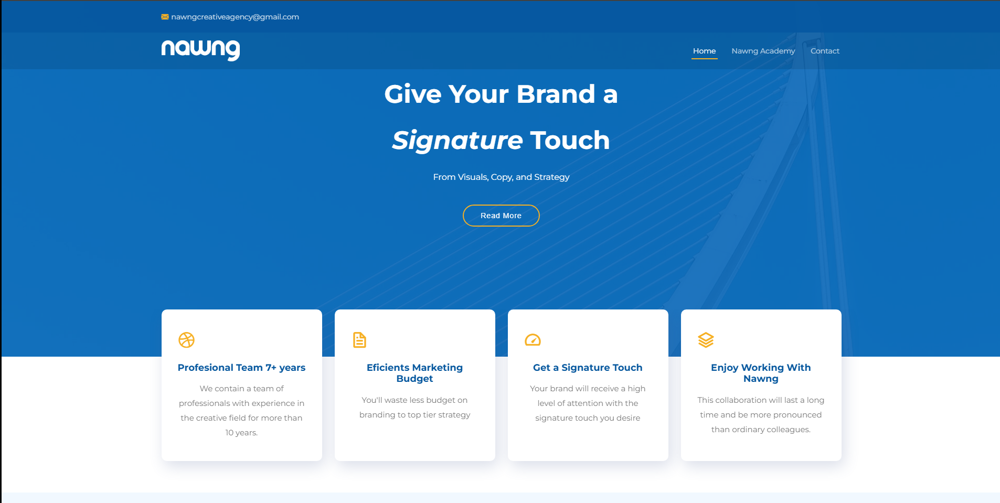

  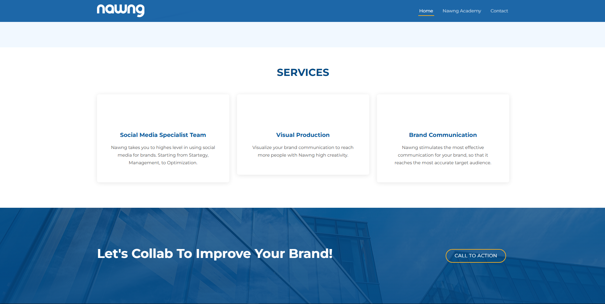

**Website Live:** [Lihat Website Nawng Indonesia](https://anandaputran.github.io/nawng/) 
**Source Code:** [Nawng Indonesia Company Profile](https://github.com/anandaputran/nawng)

---

### 02 — Nawng Chatbot Assistance

**Konteks:** Magang Web Developer 
**Peran:** Web Developer Intern 
**Jenis Project:** Website Chatbot Assistance 
**Teknologi:** FlowiseAI

Selama menjalani program magang di Nawng Indonesia, website company profile kemudian dikembangkan lebih lanjut dengan mengintegrasikan chatbot assistance untuk memberikan cara yang lebih interaktif bagi pengguna dalam memperoleh informasi mengenai perusahaan dan layanan yang tersedia.

Kontribusi saya berfokus pada pembuatan workflow chatbot menggunakan FlowiseAI serta integrasi antarmuka chatbot ke dalam website Nawng Indonesia yang telah ada.

Fase ini mengembangkan website yang sebelumnya lebih berfungsi sebagai media informasi menjadi pengalaman digital yang lebih interaktif.

#### Tampilan Chatbot

  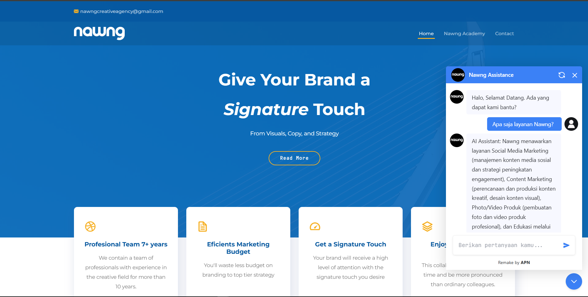

  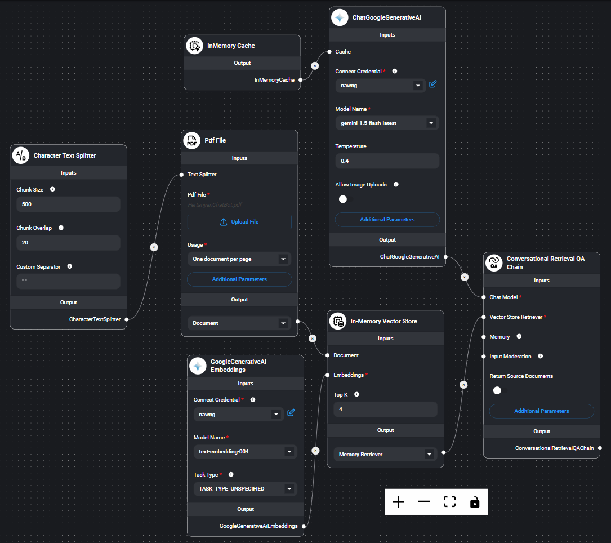

**Integrasi Live:** [Lihat Antarmuka Chatbot pada Website](https://anandaputran.github.io/nawng/) 
**Repository Implementasi:** [Nawng Chatbot Assistance](https://github.com/anandaputran/chatbot_nawng)

> **Catatan:** Antarmuka chatbot masih tersedia pada website live, tetapi respons LLM saat ini tidak aktif karena backend Flowise dijalankan secara lokal selama proses pengembangan.

---

### 03 — Nawng Academy

**Konteks:** Tugas Akhir 
**Peran:** UI/UX Designer & Mobile App Developer 
**Jenis Project:** Aplikasi Pembelajaran Android 
**Teknologi:** FlutterFlow, Firebase Authentication, Supabase Storage 
**Metodologi:** Lean UX

Nawng Academy awalnya telah hadir sebagai bagian dari konsep website Nawng Indonesia. Setelah muncul masukan internal bahwa Nawng dapat dikembangkan menjadi sebuah platform tersendiri, ide tersebut kemudian saya kembangkan lebih lanjut menjadi aplikasi pembelajaran Android standalone sebagai tugas akhir.

Aplikasi dirancang, dibuat prototipenya, dan dikembangkan langsung menggunakan FlutterFlow sehingga proses perancangan antarmuka dan pembangunan aplikasi dapat dilakukan dalam satu environment.

Nawng Academy dikembangkan sebagai platform pembelajaran digital bagi UMKM dan pelaku usaha, dengan menyediakan akses terhadap konten edukasi seperti e-book dan materi pembelajaran digital.

Proses pengembangannya menerapkan metodologi Lean UX, mulai dari identifikasi asumsi dan kebutuhan pengguna, perancangan antarmuka, pembangunan aplikasi, hingga evaluasi usability.

#### Preview Aplikasi

  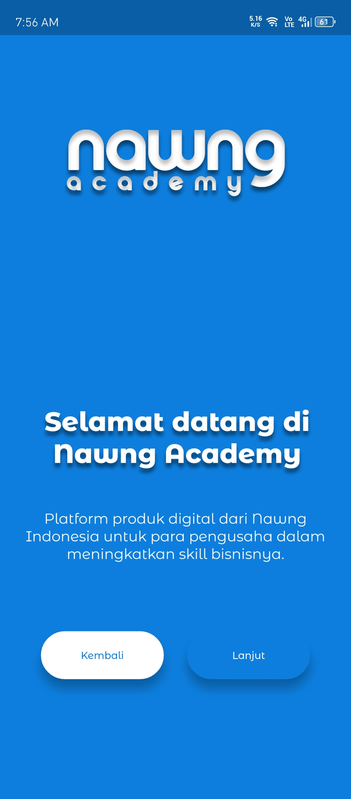
  &nbsp;
  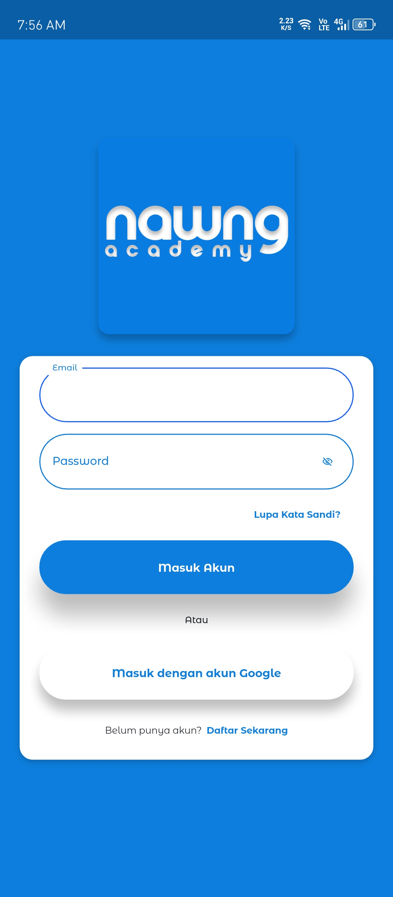
  &nbsp;
  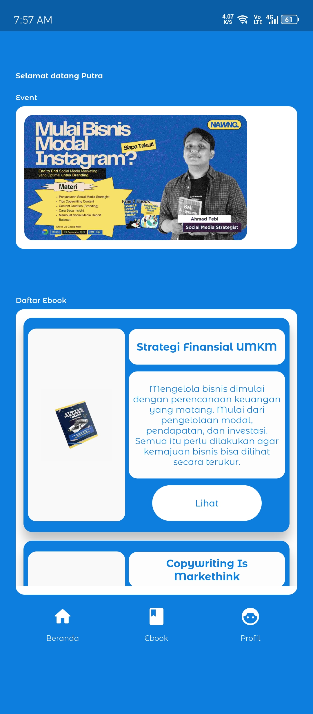

#### Alur Akses E-book

  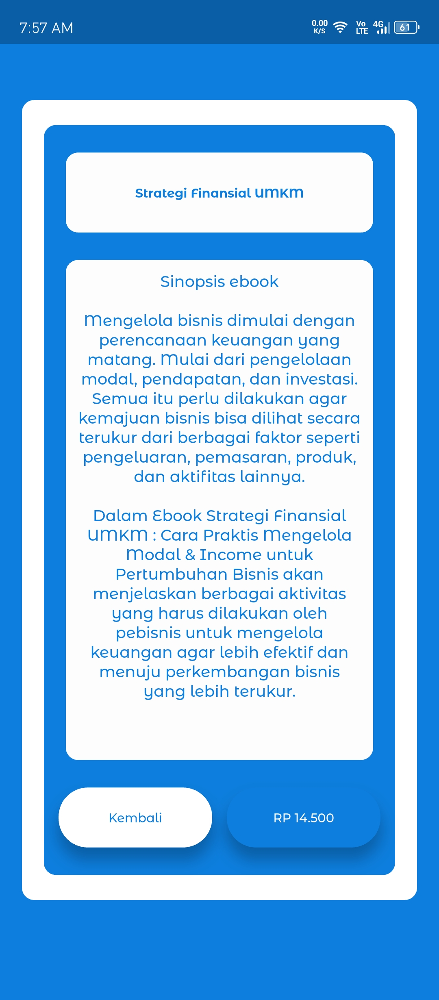
  &nbsp;&nbsp;&nbsp;
  

  <em>Perbandingan tampilan detail e-book sebelum dan setelah akses unduhan tersedia.</em>

#### Aplikasi Admin

  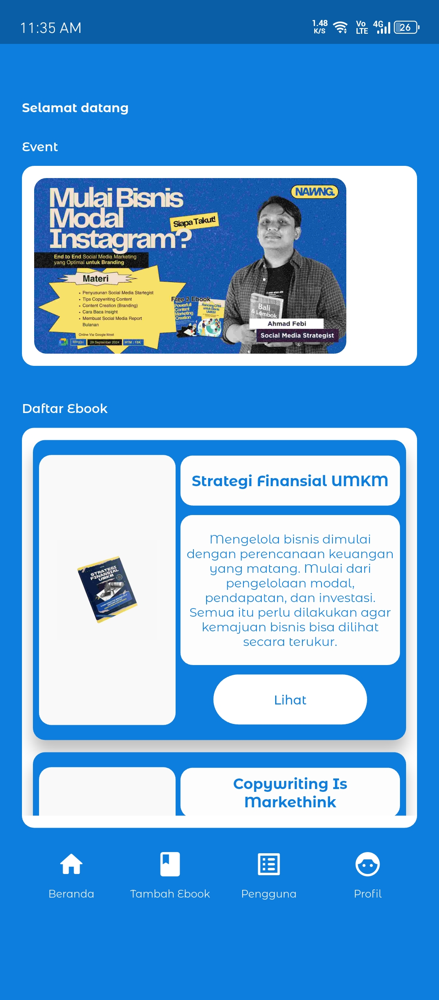
  &nbsp;
  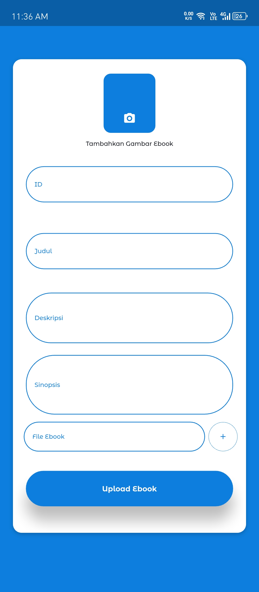
  &nbsp;
  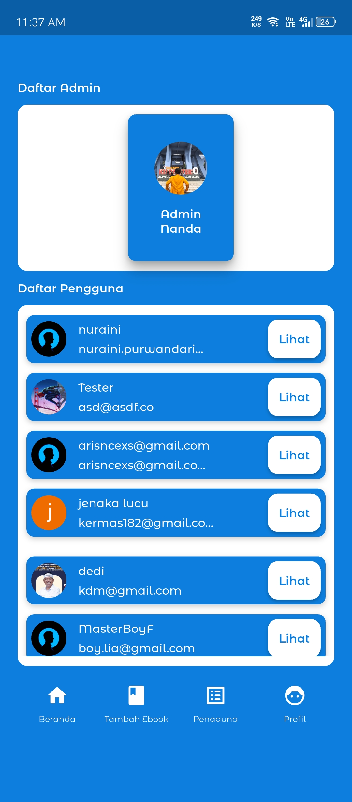

  <em>Aplikasi administrator terpisah untuk mengelola konten e-book dan pengguna terdaftar.</em>

**Source Code:** [Nawng Academy](https://github.com/anandaputran/Nawng-Academy)

#### Preview Interaktif

**Aplikasi User:** [Buka Preview Nawng Academy](https://app.flutterflow.io/preview/nawng-academy-eyjid0?page=Intro) 
**Aplikasi Admin:** [Buka Preview Nawng Academy Admin](https://app.flutterflow.io/preview/nawng-academy-admin-4i4jv8?page=Intro)

> **Catatan:** Link ini menyediakan preview interaktif dari antarmuka aplikasi. Beberapa fitur aplikasi mungkin memerlukan layanan backend atau build Android agar dapat berfungsi sepenuhnya.